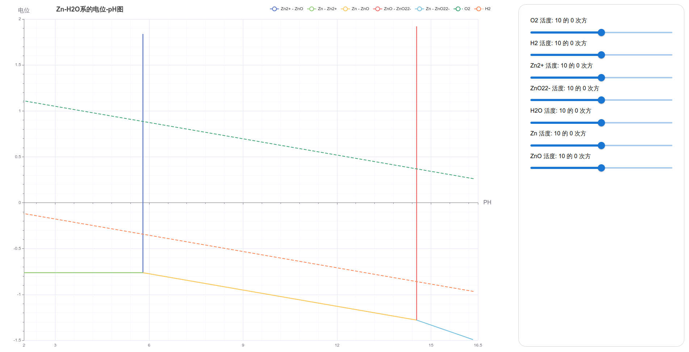

# E-pH-charts

## Description

+ Base on another repo <a href="https://github.com/irumeria/volt-ph">volt-ph</a> by irumeria

+ It shows the E-pH diagram like this, you can change the active number to see what will happen
 

## Run

+ In the project directory, you can run:

### `npm start`

### `npm run build`

